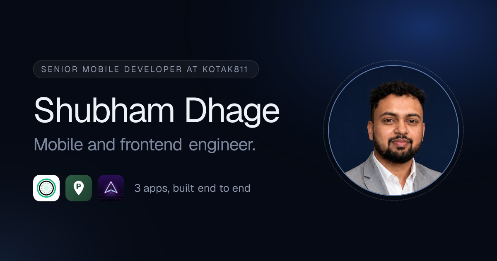

# Shubham Dhage: portfolio

Personal site of **Shubham Dhage**, Senior Mobile Developer at Kotak811, and the home of the three apps he builds and
runs end to end: **CalMeter**, **ParkSaathi** and **Neon Drift Zero**.

**Live:** [shubhamdhage.in](https://shubhamdhage.in)

<p align="center">
  
</p>

| | Performance | Accessibility | Best practices | SEO |
|---|---|---|---|---|
| Desktop | 100 | 100 | 100 | 100 |
| Mobile | 93 | 100 | 100 | 100 |

<sub>Lighthouse 12 against the local production build (`npm run build && npm start`).</sub>

---

## Contents

1. [Tech stack](#tech-stack)
2. [Getting started](#getting-started)
3. [Project structure](#project-structure)
4. [Page sections](#page-sections)
5. [Editing content](#editing-content)
6. [Design system](#design-system)
7. [Motion](#motion)
8. [SEO, sharing and AI crawlers](#seo-sharing-and-ai-crawlers)
9. [Accessibility](#accessibility)
10. [Performance](#performance)
11. [Deploying on Vercel](#deploying-on-vercel)
12. [Assets](#assets)

---

## Tech stack

| Area | What it uses |
|---|---|
| Framework | **Next.js 16** (App Router, React 19). Every route is prerendered as static content |
| Styling | **Tailwind CSS 4** (CSS-first config in `app/globals.css`, no `tailwind.config`) |
| Icons | **Phosphor** (`@phosphor-icons/react`), light weight; server components import from `dist/ssr` |
| Fonts | **Uncut Sans** (self-hosted, `public/fonts`) via `next/font/local`; **Geist Mono** via `next/font/google` |
| Images | `next/image` with AVIF and WebP |
| Share images | `next/og` (`ImageResponse`), rendered at build time |
| Animation | None as a dependency: CSS transitions and keyframes, plus `IntersectionObserver` for scroll reveals |
| Language | TypeScript (strict) |

There are only four runtime dependencies: `next`, `react`, `react-dom` and `@phosphor-icons/react`.

## Getting started

Requires Node.js 20.9 or later (developed on Node 24).

```bash
npm install
npm run dev         # http://localhost:3000
npm run build       # production build
npm start           # serve the production build
npm run lint        # ESLint (next/core-web-vitals + TypeScript rules)
npm run typecheck   # tsc --noEmit
```

Run `npm run lint && npm run typecheck && npm run build` before pushing.

## Project structure

```
app/
  layout.tsx            Fonts, site-wide metadata, skip link, JSON-LD, nav
  page.tsx              The single page: Hero, Experience, Apps, OpenSource, About, then Contact
  globals.css           Design tokens, glass utilities, keyframes, reveal styles
  not-found.tsx         Styled 404
  opengraph-image.tsx   1200x630 share card (twitter-image.tsx re-exports it)
  llms.txt/route.ts     /llms.txt, static
  robots.ts             /robots.txt (blocks preview deployments)
  sitemap.ts            /sitemap.xml
  manifest.ts           /manifest.webmanifest
  icon.png, apple-icon.png

components/
  Nav.tsx               Floating glass nav; full-screen menu on mobile          (client)
  Hero.tsx              Headline, CTAs, portrait
  RoleCycler.tsx        Rotating second headline line                           (client)
  Portrait.tsx          Circular portrait, light arc, orbiting app icons        (CSS only)
  Experience.tsx        "Where I've worked" bento
  Apps.tsx              The three app panels, screenshots, store badges
  OpenSource.tsx        npm packages and GitHub repos
  About.tsx             Bio, quick facts, stack
  Contact.tsx           Contact card and footer
  CopyEmail.tsx         Copy-to-clipboard email button                          (client)
  Reveal.tsx            Scroll reveal wrapper                                   (client)

data/site.ts            ALL site content: profile, experience, apps, open source, SITE_URL
lib/
  llms.ts               Builds /llms.txt from data/site.ts
  structured-data.ts    Builds the schema.org JSON-LD from data/site.ts

public/
  shubham.jpg           Portrait (hero, share card, JSON-LD)
  apps/<app>/           icon.png and screenshots 1.jpg to 3.jpg per app
  logos/                Kotak811, Swiggy and Rigbot logos
  fonts/uncut-sans/     Uncut Sans woff2 (Regular, Medium, Semibold)
```

Components are Server Components unless marked **client**. The client components are small leaves, so the page ships
little JavaScript.

## Page sections

| Section | Anchor | Component | Notes |
|---|---|---|---|
| Hero | `#top` | `Hero` | Rotating role, "See my work" and "See my apps" CTAs, orbiting portrait |
| Where I've worked | `#experience` | `Experience` | Asymmetric bento: the current role is the large tile |
| Apps | `#apps` | `Apps` | Two split panels with fanned screenshots, then one wide panel (no three-in-a-row zigzag) |
| Open source | `#open-source` | `OpenSource` | Rows inside one glass panel |
| About | `#about` | `About` | Bio, facts, stack chips |
| Contact | `#contact` | `Contact` | Email copy button and footer |

Each app panel also has its own anchor (`#calmeter`, `#parksaathi`, `#neondrift`). The old `/about` route
permanently redirects to `/#about` (`next.config.ts`).

## Editing content

Everything visible on the page, in `/llms.txt` and in the structured data comes from **`data/site.ts`**. Edit it there
and every surface stays in sync.

### Profile

`profile` holds the names (`name` "Shubham D" for the UI, `fullName` "Shubham Dhage" for search and sharing,
`shortName` "Shubh" for the hero), role, email, GitHub, summary, the three About paragraphs and the stack chips.

The rotating hero roles are in `components/RoleCycler.tsx` (`roles`). The hero eyebrow and description are in
`components/Hero.tsx`. The About quick facts are at the top of `components/About.tsx`.

### Experience

Each entry in `experience` has `company`, `role`, `period` ("Now", "Previously", "Before that"), `logo`, `url`, a
`summary`, `tags`, and a `tint` (RGB triplet for the card's glow). The **first entry** gets the large tile and drives
`worksFor` in the structured data. An optional `areas` list renders the "In the app" grid (only Kotak811 has one).

### Apps

Each app in `apps` has its copy, `highlights`, `stack`, `website`, `icon`, three `screenshots` (with their real pixel
`width` and `height`), `stores` and a `theme` (used for the panel tint in `components/Apps.tsx`).

**When an app goes live on a store**, change that store's `status`:

| `status` | Badge | Link |
|---|---|---|
| `"live"` | Filled pill, "Live" | Opens `url` |
| `"review"` | Outline pill, "In review" | None |
| `"soon"` | Outline pill, "Coming soon" | None |

Fill in `url` for ParkSaathi's stores once the listings exist. `/llms.txt` updates automatically.

**To add a fourth app:** add an entry to `apps`, add its images under `public/apps/<slug>/`, add a tint for its `theme`
in `components/Apps.tsx`, and decide where it goes in the `Apps` layout (it currently places exactly three panels).
The hero button and the orbit both render one icon per app. The orbit spaces icons 120 degrees apart, so update the
angle in `components/Portrait.tsx`.

### Open source

`npmModules` and `githubProjects` render as rows in that order.

## Design system

**Direction:** dark midnight navy, taken from the portrait's backdrop so the photo melts into the page, with frosted
glass panels and a single ice-blue accent. Dark only, by design: a light page would put a hard edge around the photo.

### Tokens (`app/globals.css`, `:root`)

| Token | Value | Use | Contrast on `--bg` |
|---|---|---|---|
| `--bg` | `#050a14` | Page | |
| `--core` | `#0a1324` | Solid panel fallback | |
| `--ink` | `#eef2f8` | Primary text | 17.6:1 |
| `--muted` | `#8f99ad` | Body copy | 6.9:1 |
| `--faint` | `#7d889e` | Labels, secondary headline line | 5.6:1 |
| `--accent` | `#9cc3ff` | Ice blue: "Now" pill, "Let's talk", focus rings, selection | 11.0:1 |
| `--line` | `rgb(255 255 255 / 0.07)` | Dividers | |

All text colors pass WCAG AA on every panel surface (the lowest is `--faint` at 4.7:1). They're exposed to Tailwind
through `@theme inline`, so you can write `text-muted`, `bg-core`, `text-accent`, and so on. The easing curve is
`ease-fluid` (`cubic-bezier(0.32, 0.72, 0, 1)`).

### Surfaces

| Utility | What it is |
|---|---|
| `shell` | Outer tray of the double bezel: faint gradient, hairline ring, deep shadow, `2.5rem` radius, `0.5rem` padding |
| `core` | Inner glass panel: translucent navy, `backdrop-filter: blur(24px) saturate(160%)`, lit top edge, diagonal sheen |
| `glass` | Small glass for pills, chips and secondary buttons |

Use them nested: `<div class="shell"><div class="core">...</div></div>`. With `prefers-reduced-transparency`, the
glass falls back to solid panels. Fixed ambient light orbs (`body::before`) sit behind everything so the glass has
something to refract, and a fixed grain layer (`body::after`) adds texture.

**Shape rule:** interactive elements are full pills; containers use the double bezel; media inside a panel is
`1.5rem`. Icons inside buttons sit in their own circle ("button-in-button").

**Type:** Uncut Sans for everything, Geist Mono for small metadata labels. Headlines use tight negative tracking and
fluid `clamp()` sizes.

## Motion

| Effect | Where | How |
|---|---|---|
| Hero entrance | `.rise`, `.rise-soft` | CSS keyframes, so it plays before hydration. The headline and description only slide (no fade), so they count for LCP |
| Rotating role | `RoleCycler` | All roles share one grid cell in a clipping mask; transform only, so text never loses contrast |
| Portrait | `Portrait` | Spinning conic-gradient arc, app icons orbiting (each counter-rotates to stay upright), breathing glow |
| Scroll reveal | `Reveal` + `.reveal` | `IntersectionObserver` sets `data-shown`; CSS fades, lifts and un-blurs. The end state has no `filter`, which would otherwise disable the glass inside |
| Hovers | Buttons, cards, fan | Arrow swap, icons splay, screenshots fan out, cards lift |

Every animation is disabled under `prefers-reduced-motion: reduce`, and reveals stay visible without JavaScript
(`@media (scripting: enabled)`).

## SEO, sharing and AI crawlers

| What | Where | Output |
|---|---|---|
| Title, description, keywords, canonical, robots meta | `app/layout.tsx` | "Shubham Dhage \| Senior Mobile Developer" |
| Open Graph and Twitter cards | `app/layout.tsx` + `app/opengraph-image.tsx` | 1200x630 PNG with name, role, portrait and app icons |
| Structured data | `lib/structured-data.ts` | `Person` (with `alternateName` "Shubham D", "Shubh"), `WebSite`, `ProfilePage`, one `MobileApplication` per app |
| `/llms.txt` | `lib/llms.ts` | Plain-text profile, experience, apps and open source for LLMs ([llmstxt.org](https://llmstxt.org)) |
| `/robots.txt` | `app/robots.ts` | Production allows all crawlers, AI included; previews disallow all |
| `/sitemap.xml` | `app/sitemap.ts` | Single URL |
| `/manifest.webmanifest` | `app/manifest.ts` | Name, colors, icons |

### Site URL

`SITE_URL` in `data/site.ts` resolves in this order:

1. `NEXT_PUBLIC_SITE_URL`, if set
2. On a Vercel **preview** deployment, that deployment's URL (`VERCEL_URL`)
3. Otherwise `https://shubhamdhage.in`

Previews therefore never claim to be canonical, and are kept out of search through `robots.txt`.

### Checking the share card

- Locally: open `http://localhost:3000/opengraph-image`.
- After deploying: paste the URL into [LinkedIn Post Inspector](https://www.linkedin.com/post-inspector/) or
  [opengraph.xyz](https://www.opengraph.xyz). LinkedIn and WhatsApp cache previews; Post Inspector also refreshes
  LinkedIn's copy.

To refresh `docs/og-preview.png` (the image at the top of this README), save the output of `/opengraph-image` over it.

## Accessibility

- A "Skip to content" link is the first focusable element.
- Landmarks are `header`/`nav`, `main` and `footer`, with one `h1` and headings in order (`h2` per section, `h3` per
  role and app).
- **Mobile menu:** it's a modal dialog that moves focus to its first link, closes on Escape, and returns focus to the
  toggle. While closed it is `inert` and hidden from assistive tech.
- Visible focus rings use the accent color.
- All text passes WCAG AA contrast (see [tokens](#tokens-appglobalscss-root)).
- Meaningful images have alt text; decorative icons and duplicates use `alt=""` or `aria-hidden`.
- The rotating role exposes all three roles to screen readers once, and hides the animated copies.
- The copy-email button announces "Email copied" through a live region and falls back to `mailto:` if the clipboard is
  blocked.
- Reduced motion and reduced transparency are both respected.

## Performance

- Every route is static and served from Vercel's CDN.
- No animation library. Dropping Motion removed about 75 KB of unused JavaScript and moved mobile Performance from 85
  to 91.
- The hero headline is visible on the first frame (it slides in rather than fading), so it counts as the LCP element
  instead of waiting on hydration.
- Only three Uncut Sans weights ship; Geist Mono isn't preloaded because it's only used below the headline.
- The portrait is `priority`; everything else lazy-loads. Images are served as AVIF or WebP at the size needed.
- Glass blur only runs on panels, never on large scrolling containers. Grain and ambient light are fixed
  `pointer-events: none` layers.

The mobile score's remaining gap is font download time under Lighthouse's simulated slow 4G. The real local LCP is
about 60 ms. Getting past 93 would mean dropping a font weight from the headline or buttons.

## Deploying on Vercel

1. Import the repository in Vercel. The Next.js preset is detected; no build settings or environment variables are
   needed.
2. Add **`shubhamdhage.in`** as the production domain (and `www.shubhamdhage.in` redirecting to it).
3. Deploy. Pushes to `main` deploy to production; pull requests get preview URLs that are noindexed.

Every response gets security headers from `next.config.ts`: `Strict-Transport-Security`, `X-Content-Type-Options`,
`X-Frame-Options: DENY`, `Referrer-Policy` and `Permissions-Policy`. The `X-Powered-By` header is off.

## Assets

### Portrait

`public/shubham.jpg` (759x620). A larger original would look sharper on high-density screens; replace the file and
keep the name. The hero crops it to a circle around the face (`object-[56%_38%]` in `components/Portrait.tsx`).

### App icons and screenshots

These come from each app's own repository and were resized on macOS with `sips`:

```bash
# Screenshots: longest side 1200px, JPEG quality 82
sips -s format jpeg -s formatOptions 82 -Z 1200 <source>.png --out public/apps/<slug>/1.jpg
# Icons: 256px PNG
sips -Z 256 <icon-512>.png --out public/apps/<slug>/icon.png
```

| App | Screenshots from | Icon from |
|---|---|---|
| CalMeter | `calmeter/playstore/screenshots-final/` | `calmeter/playstore/play-icon-512.png` |
| ParkSaathi | `parksaathi/playstore/store-screenshots/` | `parksaathi/playstore/playstore-icon.png` |
| Neon Drift Zero | `neondriftzero-game-ios/docs/store/screenshots-6.9/` | `neondriftzero-web/public/icons/icon-512.png` |

After replacing a screenshot, update its `width` and `height` in `data/site.ts` (`sips -g pixelWidth -g pixelHeight`).

### Company logos

| Logo | Source | Change |
|---|---|---|
| `logos/kotak811.svg` | kotak811.bank.in | The dark-navy "11" bars recolored white so they show on the dark page; the red 811 mark is unchanged |
| `logos/swiggy.svg` | [Simple Icons](https://simpleicons.org) (`swiggy`) | Brand orange; the "Swiggy" wordmark beside it is text |
| `logos/rigbot.png` | rigbot.com | None (white wordmark) |

Company logos are trademarks of their owners and are used here only to identify employers.
